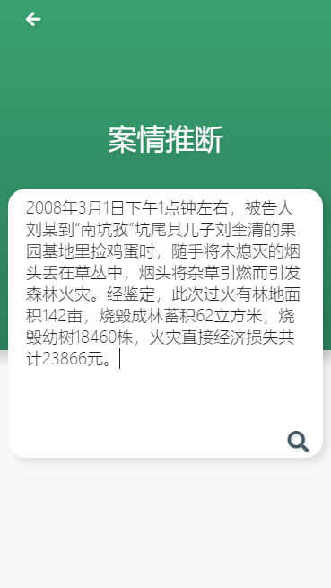
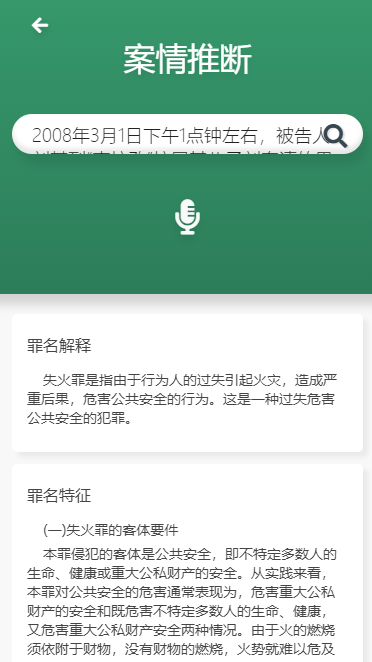
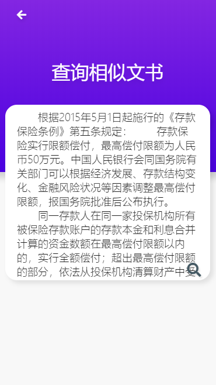
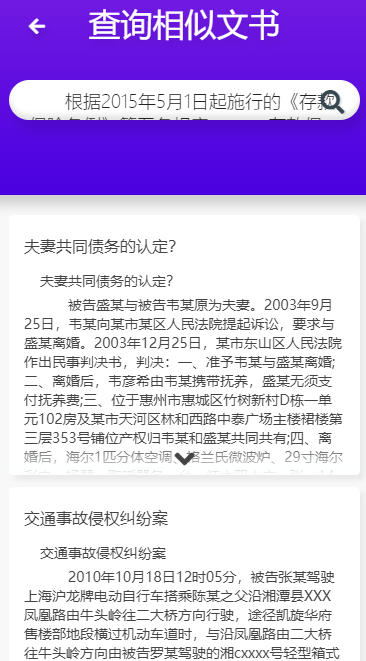

## 			一款基于SVM算法的分布式法律助手


### 一. 项目简介 与 使用说明

**体验网站(适配手机端): www.zhuchangwu.com**

项目基于 Spring Cloud 、Vue 构建，平台针对需要维权的用户而设计，主要提供如下三个功能模块。

* 一、**提供问答服务模块**。

  用户可以在本模块中描述一句简短的话，系统将为用户推送出与用户描述相似的问题及答案。

* 二、**罪名推断模块**。

  用户可以输入一个场景，系统将给用户推送出此场景可能触发的罪名，量刑区间，以及可能触发的法律法规。

* 三、**相似判决文书查询模块**。

  用户可以将自己的判决文书输入到系统中，系统将会为用户推送相似的判决文书。

> **如果您感觉还蛮有趣，欢迎star！！！**

**主页**


**问答服务 - 支持前缀匹配，全文检索**


**罪名推断：**

**点击主页的案情推断，输入一段场景**



**点击搜索：得出如下响应**




**相似文书查询：**

**将您的文书拷贝进文书查询模块，点击搜索，系统将推送给您往年相似的判决文书**



**结果如下：**




### 二. 主要技术点

- 前后端分离架构，**前端Vue + 后端SpringCloud**。
- **基于 ElasticSearch 的搜索提示及全文检索功能**为用户提供问答服务。
- **集成机器学习分类算法模型 SVM， 文本分类，推断相关罪名**。
- **基于simhash算法，实现相似文本检查**。
- **Java 与 Python 使用Apache Thrift完成异构RPC调用**。
- **使用Docker将SVM模型容器化，可移植性很强**。
- **项目部署：静态资源服务器 Nginx。**


### 三. 环境搭建

#### 3.1 后端

* 后端SpringCloud版本：Finchley.SR2 。
* 开发工具:  IDEA。
* Maven版本: 3.3.9 。

同学们自行将本项目clone到本地导入idea即可使用。

#### 3.2 前端

前端github地址:  <https://github.com/zhuchangwu/lawyer-lover-vue-frontend> 

nodejs版本:   v10.14.1

安装命令:  

```bash
npm install serve
```

前端代码精简，如果感兴趣可以拉取下来自行开发

鸣谢:  前端贡献者 '集智慧与美貌于一身'的:**[CamWang](https://github.com/CamWang )**

#### 3.3 SVM算法-Docker镜像

推荐: 使用我封装好的SVM算法模型的Docker镜像，目前已经打包发布在云上， 优点如下:

* 基于Docker构建，可移植性很好，同学们可以直接拉取到自己服务器的Docker上，开箱即用。
* 添加了ApacheThrift 依赖，将算法模型封装成了 Thrift - Server ，实现了和 Java-SpringCloud 的异步RPC通信。

如何拉取镜像: 

```bash
### 1. 启动docker
### 2. 拉取镜像
sudo docker pull registry.cn-beijing.aliyuncs.com/changwu/lawyer:release
```

使用镜像

```bash
# 1. 启动镜像：
docker run --name [指定容器名] -i -t -p 9998:9998 -d [ImageId]

# 2. 进入容器：
docker container exec -it [指定的容器名或者容器的ID] /bin/bash

# 3. 启动模型：
docker run 

# 4. 切入目录
cd /home/lawer

# 5. 使用tmux使py在后台运行 ， 在bash输入如下命令
tmux

# 6. 进入tmux，在tmux中启动程序 ，模型需要加载大约30s完成启动，在控制台可以看到启动日志
python thrift_server.py

# 7. 模型启动后，可以退出镜像 `exit`  或者直接关闭ssh终端， 模型都会正常运行
# 8. 重新ssh上去之后，执行如下命令,可以看到python程序还在正常执行
tmux attach
```

> 鸣谢：liuhuanyong教授： [算法模型来源](https://github.com/liuhuanyong/CrimeKgAssitant ) 

#### 3.4 Nginx相关配置

同学们在上线当前项目时推荐使用Nginx服务器代理静态资源  。

当前项目使用Nginx做了如下几点工作，同学们自行可以参照提供的配置项做适当修改。

* Nginx代理Vue打包生成的静态资源。
* 解决前段端的跨域配置。
* 将用户在前端请求转发到后端SpringCloud网关。

nginx相关配置文件路径: /reources/nginx-conf  。

### 四. ElasticSearch相关

#### 4.1 版本: 

推荐使用 6.2.4 

因为我针对法律主题，做了的分词器定制化( 拓展了词库 )， 下文有提及。

至于ES的安装本文不再展开了，同学们可以自行百度安装。

#### 4.2 创建Index：实体类->Index

* 问答模块index的建立脚本

```java
PUT /ai_answer_question
{
  "mappings": {
    "answer_question" : {
      "properties" : {
        "title" : {
          "type": "text",
          "analyzer": "ik_max_word",
          "fields": { // 添加搜索推荐  suggest
            "suggest" : {
              "type" : "completion", // 特定的类型
              "analyzer": "ik_max_word" // 指定分词器
            }
          }
        },
        "content": {
          "type": "text", 
          "analyzer": "ik_max_word"
        }
      }
    }
  }
}

```


另外两个模块的测试类像下面这样写测试类，通过Template无脑创建就行

```java
@RunWith(SpringRunner.class)
@SpringBootTest
public class CrimeTest {

  @Autowired
  ElasticsearchTemplate template;
  @Autowired
  CrimeRepository repository;
  @Test
  public void deleteIndex(){
       template.deleteIndex(Crime.class);
  }

   @Test
   public void testCreateIndexAndMapping() {
      template.createIndex(Crime.class);
      template.putMapping(Crime.class);
   }
}
```


#### 4.3 Ik分词器

推荐我提供的IK分词器: 路径： /resource/ik 

原因: 

* 拓展中文词库。
  *  加入了法律相关的专有名词，提高专业名词的得分率和召回率。

- 加入了停用词(问候词)

  - 这么设计的初衷是考虑到项目中的搜索提供功能， 比如用户输入了 房产XXX ，那么我们将为其进行搜索并提示他有哪些以用户输入关键字开头的词条。
  - 如果用户仅仅是输入了: 你好，请问 这类词语将被ES过滤掉，而不理会。
  - 如果你觉得不合理，可以去ik/conf中修改相关配置。

  

### 五.  数据

下面三个模块的数据挺大的， 就不上传到github了，同学搭建项目时如果需要如下三个模块的测试数据 ， 可以**扫描下面二维码关注，回复：data**    领取后，自行导入ES即可。

* 相似文书模块依赖的数据：

* 罪名推断模块依赖的数据：

* 问答模块依赖的数据：


**导入罪名模块测试的方法**

```java
@Test
public void add() {
    File file = new File("F:\\新建文件夹\\crime.json");
    try {

        Set<Crime> set = new TreeSet<Crime>(new Comparator<Crime>() {
            @Override
            public int compare(Crime o1, Crime o2) {
                //字符串,则按照asicc码升序排列
                return o1.getCrimeName().compareTo(o2.getCrimeName());
            }
        });

        BufferedReader bufferedReader = new BufferedReader(new FileReader(file));
        String result = null;
        while (((result = bufferedReader.readLine()) != null)) {
            Crime crime = JsonUtils.jsonToPojo(result, Crime.class);
            set.add(crime);
        }

        System.out.println(set.size());
        for (Crime crime : set) {
            repository.save(crime);
        }

    } catch (Exception e) {
        e.printStackTrace();
    }
}
```


### 六. 联系

可以通过博客联系我: 

<https://www.cnblogs.com/ZhuChangwu/> 


欢迎关注微信公众号领取数据，（公共号刚起步，后续会分享整理的面试题） :


